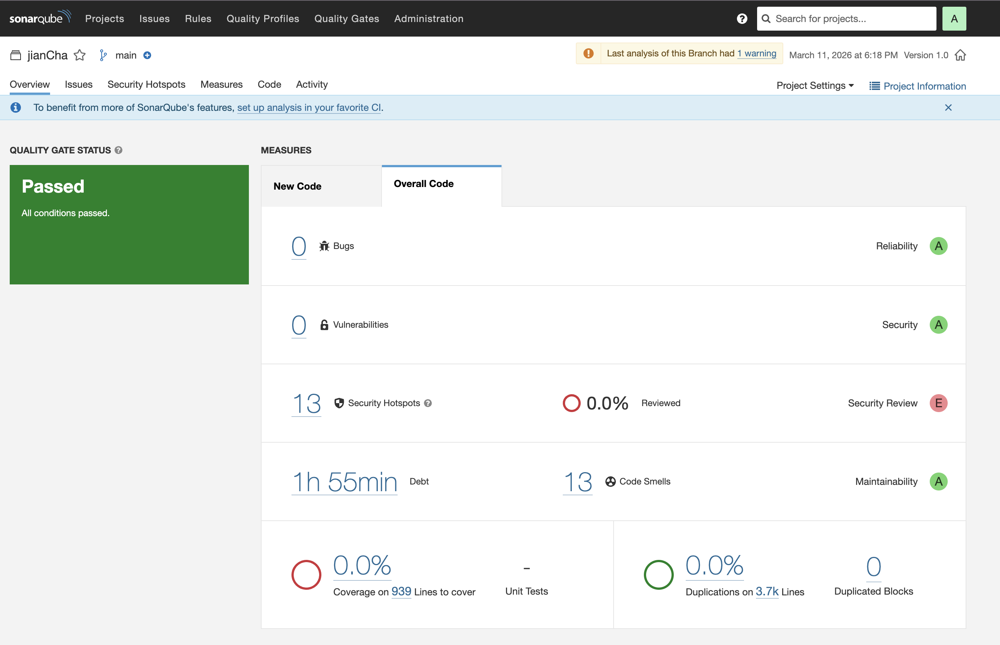
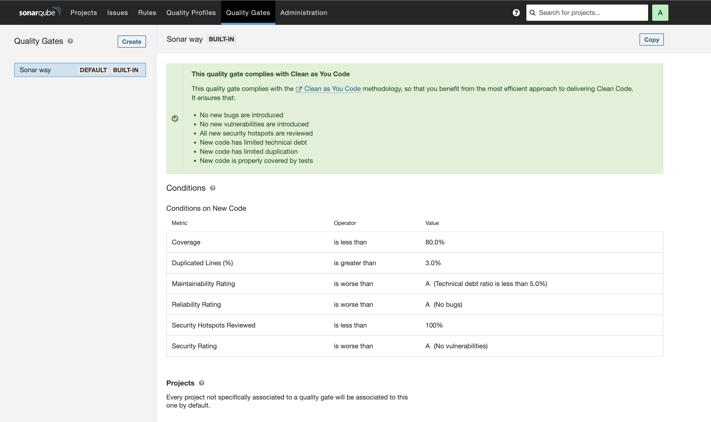
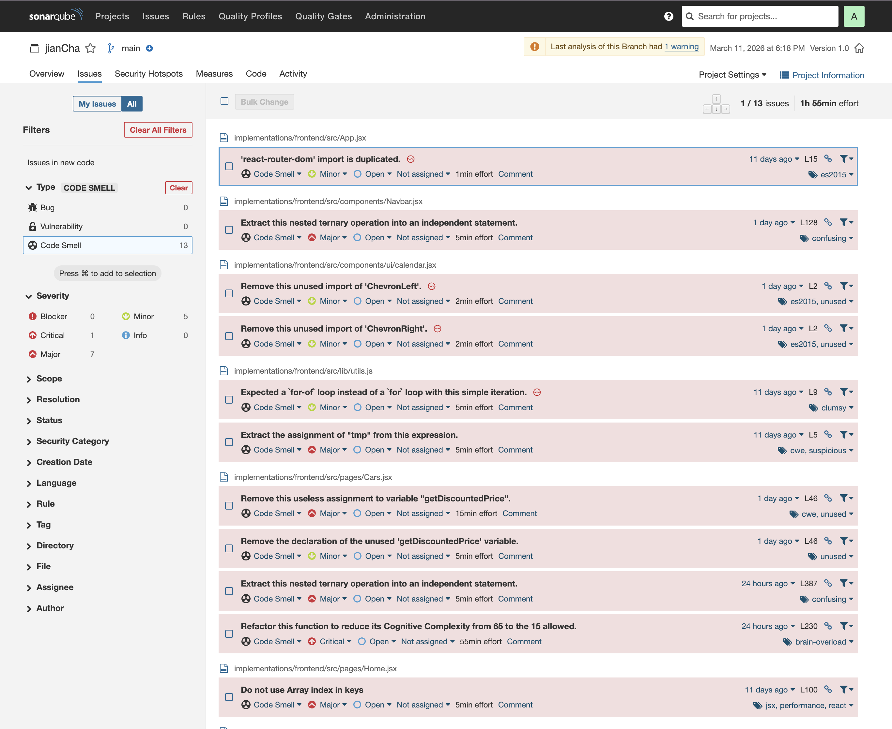

## SonarQube Analysis Page

### Screenshot

---

## Executive Summary

The SonarQube analysis provides an overview of the overall quality of the project’s source code. According to the report, the project successfully **passes the Quality Gate**, which means that the code meets the minimum quality requirements defined by SonarQube.

Overall, the system demonstrates **strong reliability, security, and maintainability**, each receiving an **A rating**. This indicates that no major bugs or security vulnerabilities were detected during the analysis. However, the report still highlights several areas that could be improved, particularly related to **code maintainability, security hotspot review, and test coverage**.

Although these issues are not critical, addressing them would help improve the long-term quality and sustainability of the codebase.

---

## Quality Gate Configuration

The project uses the default **Sonar Way Quality Gate**, which follows the *Clean as You Code* methodology. This quality gate defines the conditions that newly added code must satisfy in order to maintain a healthy codebase.

The key conditions enforced by this quality gate include:

- No new bugs should be introduced
- No new vulnerabilities should appear
- All security hotspots must be reviewed
- Test coverage on new code should remain above 80%
- Code duplication should remain below 3%
- Maintainability, reliability, and security ratings should remain at grade **A**

These rules ensure that new changes do not degrade the overall quality of the system and help maintain consistent coding standards throughout the project.

---

## Key Metric Analysis

### 1. Reliability & Stability (Rating: A)

**Issues:**  
The analysis detected **0 bugs** in the current codebase.

**Observation:**  
This result suggests that the project does not contain known patterns that typically lead to runtime failures or incorrect behavior. As a result, the system receives a **Reliability rating of A**, indicating that the code is currently stable and unlikely to cause unexpected errors during execution.

Maintaining this level of reliability will require consistent code review and testing, especially when new features are introduced.

---

### 2. Maintainability (Rating: A)

**Issues:**  
SonarQube identified **13 code smells** within the project.

**Technical Debt:**  
The estimated effort required to resolve these issues is approximately **1 hour and 55 minutes**.

**Observation:**  
Code smells are not functional errors but rather indicators that some parts of the code could be improved for better readability and maintainability. These issues often involve inefficient coding patterns or unnecessary complexity.

Some examples of the detected problems include:

- duplicated module imports
- unused variables or unused imports
- nested conditional expressions that reduce readability
- unnecessary variable assignments
- functions with high cognitive complexity

Despite these issues, the project still maintains an **A rating in maintainability**, which indicates that the overall structure of the codebase is still manageable and relatively easy to maintain.

---

### 3. Security Review

**Vulnerabilities:**  
No security vulnerabilities were detected in the project.

**Security Hotspots:**  
The analysis identified **13 security hotspots**, with **0% currently reviewed**.

**Observation:**  
Security hotspots are not automatically classified as vulnerabilities. Instead, they represent areas in the code that may potentially involve sensitive operations and therefore require manual inspection by developers.

For example, one hotspot flagged by SonarQube involves **a potentially hardcoded credential in a test file**. Although this might be acceptable in a controlled testing environment, it is still recommended to review such cases to ensure that sensitive information is not accidentally exposed in production code.

---

### 4. Test Coverage

**Coverage:**  
The report shows **0% test coverage**, with **939 lines of code that could potentially be covered by tests**.

**Observation:**  
This means that there are currently no automated tests being tracked by SonarQube for this project. While the system may still function correctly, the absence of automated testing increases the risk that future changes could introduce undetected bugs.

Improving test coverage would significantly increase confidence in the stability of the application and make future refactoring safer.

---

### 5. Code Duplication

**Status:**  
The analysis shows **0 duplicated blocks**, resulting in **0% code duplication across approximately 3.7k lines of code**.

**Observation:**  
This indicates that the project avoids repeating the same logic across multiple files. Low duplication is beneficial because it reduces maintenance effort and minimizes the risk of inconsistent behavior when updates are made.

---

## Issue Overview

The analysis identified **13 code smell issues** in total. These issues are mostly related to maintainability and coding practices rather than functional errors.

Examples of issues reported by SonarQube include:

- duplicated imports in React components
- nested ternary operations that reduce readability
- unused variables and imports
- functions with high cognitive complexity
- using array indexes as keys in React lists

Although these issues do not affect the correctness of the program, resolving them would help improve code clarity and maintainability.

---

## Discussion

From the analysis results, it can be observed that the project maintains a generally **healthy level of code quality**. The absence of bugs and vulnerabilities suggests that the application logic is implemented correctly and does not currently present significant reliability or security risks.

However, the report also highlights several areas that deserve attention. The presence of multiple **code smells** suggests that certain parts of the codebase could benefit from refactoring. While these issues do not directly impact functionality, they may increase maintenance effort as the project grows.

Another important observation is the **lack of test coverage**. Without automated tests, it becomes more difficult to ensure that future modifications do not introduce regressions or unexpected side effects. Implementing unit tests and integration tests would significantly strengthen the reliability of the system.

Additionally, the **security hotspots identified by SonarQube should be reviewed carefully**. Even though they are not confirmed vulnerabilities, they represent potentially sensitive areas that developers should verify to ensure that best security practices are followed.

Overall, the analysis suggests that the project is in a good condition, but there are still opportunities for improvement, particularly in **testing practices, code refactoring, and security review processes**.

---

## Conclusion

The SonarQube analysis provides valuable insight into the quality of the project’s source code. The system successfully passes the Quality Gate and demonstrates strong reliability, security, and maintainability ratings.

Although the project currently meets the required quality standards, further improvements can be made by addressing maintainability issues, reviewing security hotspots, and increasing automated test coverage.

By gradually resolving these areas, the project will become more robust, maintainable, and easier to evolve in the future.